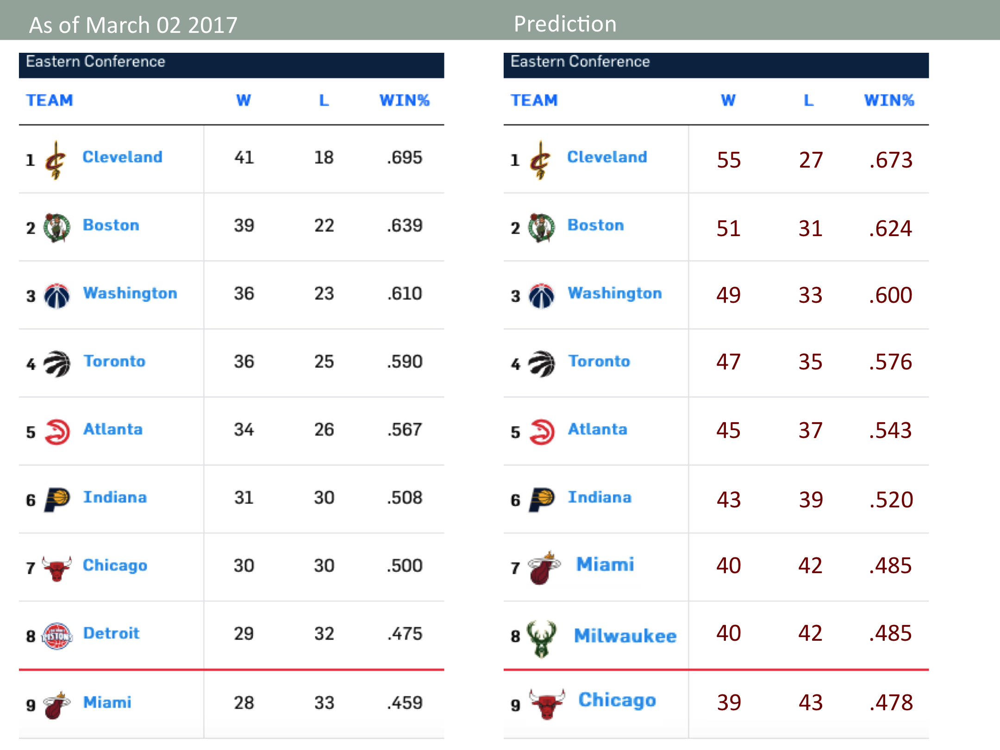
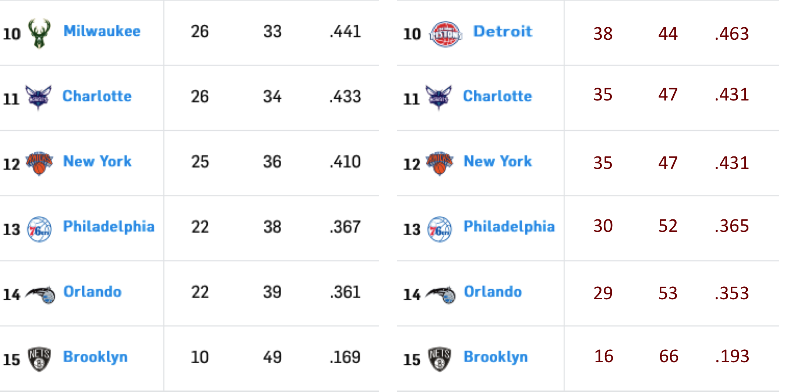
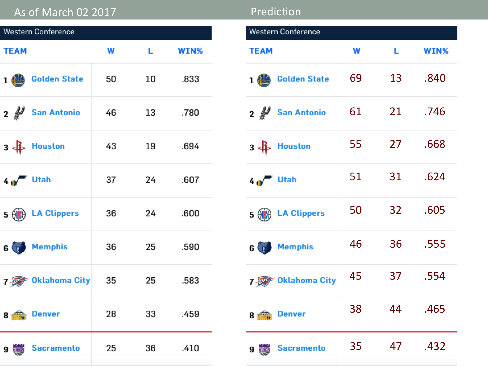

# nba3shooting
NBA's 3 Point Shooting Trend

## Introduction
Anyone who have been watching NBA games would have noticed that the league has started shooting more threes. The top winning teams are also the best 3-point shooting teams. Do 3-point shootings actually lead to winning in the NBA?

In this project, I: (1) explore possible correlations between 3-point shooting and the winning, and (2) predict the 2016-2017 season results of each team, based on the correlations.

## Code
See Jupyter Notebook for detailds: winning_analysis.ipynb

## Requirements
- [Anaconda / Python 3.5](https://www.continuum.io/downloads)
- [scikit-learn](http://scikit-learn.org/stable/)

## Predictions
East Conference

West Conference

